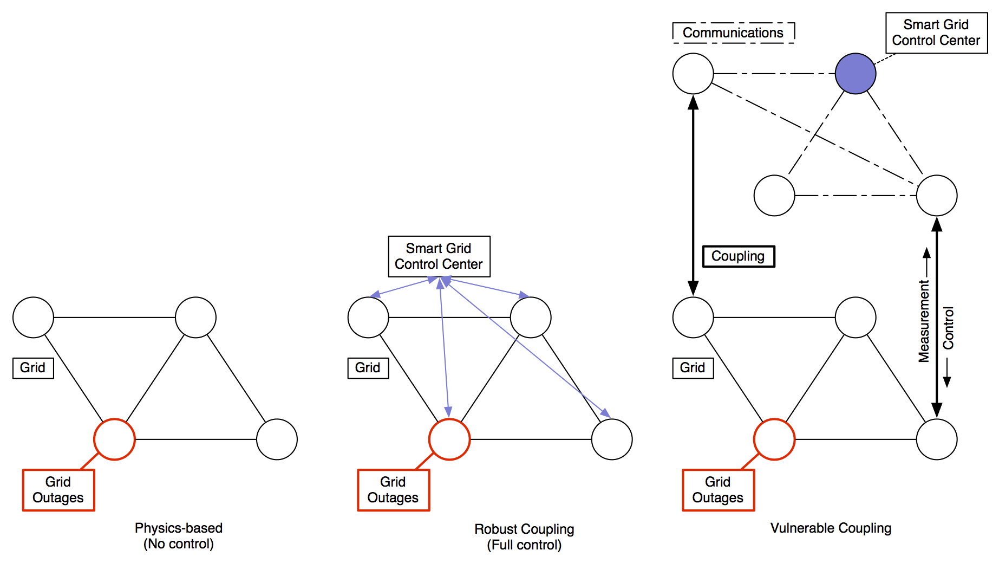
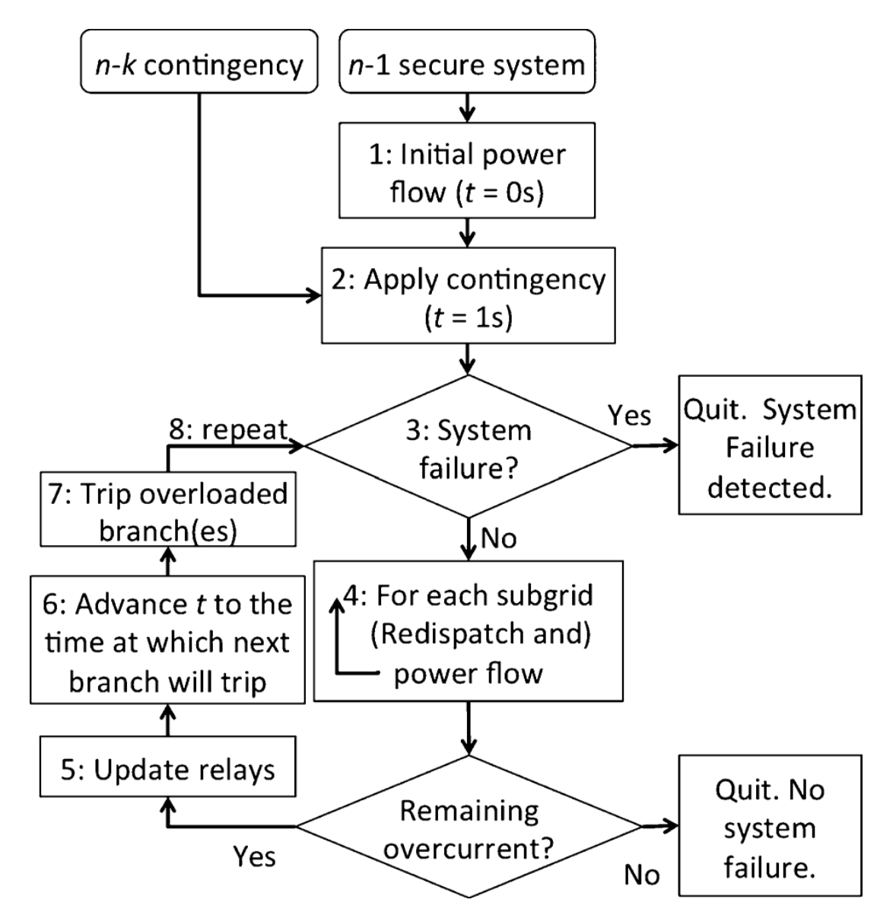

# Coupled networks model



## Model description

The coupled networks model contains a set of tools to simulate cascading outages on networks. All of the experiments conducted for the accompanying paper, [Reducing Cascading Failure Risk by Increasing Infrastructure Network Interdependency](images/Korkali (2016) - Reducing Cascading Failure Risk by Increasing Infrastructure Network Interdependence.pdf), can be reproduced with this model. The following describes the model and how to run it.

## Overview

The fundamental behavior of the model is illustrated in the figure above. Here we see the differences in internetwork cascading mechanisms between (a) the “Coupled Topological” model (based on [Buldyrev et al., 2010](http://www.nature.com/nature/journal/v464/n7291/full/nature08932.html)) in which failures propagate immediately from the power network to the communications network and the (b) “Intermediate” Smart Grid model where failures can propagate within the power network and have a chance of causing communications failures. In the Coupled Topological model, an initiating disturbance 1 causes 2 edge failures in the power grid as well as 3 node and edge failures in the communications (comm) network. As a result, the size of the giant component is reduced to 0.8N. In our smart grid models, the initiating failure 1 potentially causes overloads 4 , which causes an edge failure and 5 a loss of power at the “sink” node. This may (depending on the availability of backup power) cause a communication node failure 6 and thus communication link failures 7 , which fracture the communication network and prevent messages from being passed from and to the control center. 

## Architecture

The coupled networks model is comprised of four modules described in this section. 

1. Simulation Environment

2. Cascading Failure Simulator

3. Smart Grid Model

4. Coupling Model

An illustration of the interactions between these modules is [here](images/coupling-model-architecture.png).

### Simulation environment

The simulation environment sets up the failure/attack scenarios to run and compiles the results of each scenario. Simulations can be performed across either sets of node outages with ```cn_runner.m``` or across sets of network couplings with ```cn_runner_q.m```. To ensure repeatable results we pre-computed random node outages and couplings for the power grid used in the accompanying paper. These are found in ```data/node-removals``` and ```data/coupled-nodes``` directories respectively. The parameters section describes in more detail how these files are used.

### Cascading failure simulator

A physics-based DC power flow cascading failure simulator (CFS), ```dcsimsep.m```, is used to provide a more realistic model of failures in the power grid. The CFS algorithm is detailed in the image below from [this paper](http://ieeexplore.ieee.org/document/6672899/) which also has more details on the CFS. 



In the configuration the use of the CFS is activated by setting ```real``` to true. If ```real``` is true then coupling model, ```couplednetworks.py```, is being called by the CFS and node outages are read from a file created by the CFS model.

### Smart grid model

The smart grid model enables additional control and measurement capabilities for the CFS to use to mitigate outages. If the configuration parameter ```two_way``` is true then ```dcsimsep.m``` will call ```take_control_actions.m``` and commence the smart grid mitigation procedures outlined in our paper.

### Coupling model

The coupling model is fully contained in ```couplednetworks.py```. It can be run by itself to explore topological cascades on coupled networks or used by the smart grid model to determine the impact of couplings on physics-based cascading failures.

This model indicates how node removals after an attack may leave a network, network A, with some nodes that no longer have links to nodes in network A. When a node no longer has links within its own network we look to its coupled node in its interacting network, network B, and remove all of the links leaving this coupled node. Now network B may have orphaned nodes and the process repeats in the other direction until there are no more orphaned nodes in either network. After the cascade stops we check power loss (if used with the CFS) and the size, i.e. number of nodes, of the giant component of the network that was initially attacked, in this case network A. 

#### Running the coupling model

Two networks are created based on the following parameters in config.json: ```network_from_file```, ```network_type```, ```k```, ```n```, and ```random_rewire_prob```. If ```network_from_file``` is true then the networks are read from ```comm_network_location``` and ```power_network_location``` - ```network_type```, ```k```, ```n```, and ```random_rewire_prob``` are used only in output file names and do not impact the model in this case. Otherwise networks are generated based on ```network_type```, ```k```, ```n```, and ```random_rewire_prob``` as described in the parameters section.

After the networks are created, an attack occurs that removes nodes on the networks. The nodes attacked are determined by the parameters ```outages_from_file``` and ```real```. If ```outages_from_file``` is true then the nodes attacked at each ```p_value``` are read from bus_outages_n.csv where n is the replicate number ```r_num```. Each bus_outage file contains 100 random, pre-generated sets of node removals for every ```p_value``` from 0.5 to 0.955 in steps of 0.005. 

The two networks are connected by nodes at a rate of ```1:q```, ```q``` in ```[0,1]```. ```q``` is set by ```deg_of_coupling```. ```q==1``` implies that each node in one network is connected to exactly one other node in the other network. At ```q==0``` there are no connections between networks while ```0<q<1``` leads to a fraction of nodes are connected across networks.

The coupling model can be run in standalone mode from the command line like so:

	machine:src user$ python couplednetworks.py -1 -1 -1 config.json

The program takes four required arguments and one optional argument:

*	```mpid``` - MATLAB process id.

*	```cfs_iter``` - Iteration number from MATLAB.

*	```percent_removed``` - Percent of nodes removed for this model run.

*	```config``` - Name and location of the configuration file.

*	```r_num``` - Optional - Replicate number to use when running from an HPC. ```r_num``` determines which outage file to use.

All arguments, aside from config.json, can be set to -1 if running without the CFS model.

## Parameters in config.json

The parameters listed here provide a wide scope for designing different experiments to run with this set of coupled networks modeling capabilities.

*	```k```
	*	Average degree as a float. Used to determine ep, probability of edge creation, a parameter to generate Erdos-Renyi random graphs. ep = k / n-1. This is cast to an integer for and must be even RR graphs. Ignored if ```network_from_file``` is true.
*	```n```
	*	Number of nodes. n = 2383 for the Polish grid that was used as a baseline transmission grid.
*	```runs```
	*	Number of times to run the model if not running in batch mode. For batch mode set this to 1.
*	```p_values, p_min, p_max```
	*	Number of distinct percent-removals, ```p_values```, to do across ```[p_min p_max]``` in each run. 
*	```real```
	*	Set to true if using a CFS model for the power grid. If false then the power grid is only modeled topologically, not physically.
*	```start_with_comms```
	*	Starts the attack on the communication network, network A, instead of the grid, network B.
*	```gc_threshold```
	*	The fraction of the number of components in the giant component of the communications network, network A, under which failure is declared. For replication of the work by Bulydrev et al. this should be 0.
*	```grid_gc_threshold```
	*	The fraction of the number of components in the giant component in the grid, network B, under which blackout is declared.
*	```output_gc_size```
	*	When running without the CFS (i.e. ```real``` is false) the size of the giant component will be output if this is true. Otherwise the output files will only tell you whether the GC size was larger than the threshold. The size of the giant component is always written out when running with the CFS.
*	```lambda```
	*	When used with the CFS this can be used to vary the weight vector λ. The normal value is 100 but changing it to 50 or 200 does not make much difference.
*	```outages_from_file, min_outage_point, num_outages_in_file```
	*	If ```outages_from_file``` is true, reads the outages from coupled-networks/data/node-removals/ instead generating them as the model runs. The ```min_outage_point```, ```num_outages_in_file``` determine which outage file to read from. ```inverse_step_size``` should always be 200 unless new outages from file are created.
*	```inverse_step_size```
	*	1/(p2-p1) where p is the percent of nodes/branches removed. If the step size is 0.005 then inverse_step_size must be 200. Used to find the proper node/branch outage file.
*	```coupling_from_file, num_outages_in_coupling_file, min_coupling_point, inverse_step_size_for_coupling```
	*	For defining how to access the couplings from file in a similar way the outages are accessed. ```inverse_step_size_for_coupling``` should always be 100 unless new couplings from file are created.
*	```targeted```
	*	Sorts the network in order of degree sequence and returns a list of nodes to attack starting with the highest degree node.
*	```output_removed_nodes```
	*	When removing links, returns a list of nodes in networkB but not in networkA. When running with CFS, i.e. real == true, this needs to be true as well.
*	```output_removed_nodes_to_DB```
	*	Write the configuration (config.json), the original networks, and the status of the networks at every step of each pValue of each run to a database. Requires pymongo as an import, MongoDB installed on the system the model is running on, and the mongod daemon running.
*	```log_all_p_values```
	*	Write the output to file at the end of each replicate instead of just at the end of all replicates.
*	```write_networks_out```
	*	Write generated networks out to file. Specify either "edgelist" or "json" to write the networks to those file types. Set to "" to not write networks out or if using pre-generated networks. This can be useful to check the networks that are generated if not getting them from file. However, it will produce a lot of files depending on how many runs are being done.
*	```network_type```
	*	Sets either the name of types of networks to use. If networks are being generated this must be either 'SF' (scale-free), 'RR' (random regular), 'ER' (Erdos-Renyi), 'CFS-SW' (cascading failure simulator/small-world). CFS-SW uses the topology of the Polish grid as the power network and some rewiring of that (set by ```random_rewire_prob```) for the communication network. If networks are being read from file then this can be anything and it gets placed in the name of the output files.
*	```random_rewire_prob```
	*	Used to rewire generated scale-free and CFS-SW networks. If ```random_rewire_prob``` is -1, base the comms network on a configuration model otherwise the comms will be randomly rewired with this probability. For scale-free networks in a Bulydrev-type replication, λ = ~3 when ```random_rewire_prob``` = 0.16, λ = ~2.7 when ```random_rewire_prob``` = 0.31, and λ = ~2.3 with rewireProb = 0.57.
*	```show_plot```
	*	Produce a plot of the output at the end. Requires matplotlib as an import. Set to false if running in batch mode to save memory.
*	```shuffle_networks```
	*	Randomly renumber the nodes on the networks. For a replication of a Bulydrev-type run this should be true. When using with the CFS it should be false.
*	```generate_each_run```
	*	If true, generate a new network for each run. If false, keep the same network for all runs.
*   ```log_level```
    *    Sets the level of messaging for the Python logger. In order of increasing number of messages: 30 = warning, 20 = info, 10 = debug.
*	```verbose```
	*	If true, prints detailed messages about what is happening in the power model as it is running.
*	```debug```
	*	Passed as an argument to the compiled MATLAB telling it whether to print status messages to the console.
*	```output_result_to_DB```
	*	If true, sends the run results to a MongoDB database similar to ```output_removed_nodes_to_DB```.
*	```single_net_cascade```
	*	Only applicable in singlenetwork.py. Determines whether outages lead to cascades.
*	```find_scaling_exponent```
	*	If the powerlaw module is installed this will print out the scaling exponent of the networks in the model.
*	```batch_mode```
	*	Set to true when running from a cluster. Each run is written to its own output file. If false, cfs_comms_model will send the runs to all available cores found on the workstation the simulation is running on and then combine the results at the end.
*	```deg_of_coupling```
	*	The fraction of nodes connected between networks in [0,1].
*	```hpc```
	*	For running in batch mode. If this is set to "HIVE" then the condor process ID, which starts at 0, is incremented by 1 to ensure the correct outage and coupling files are retrieved.
*	```network_from_file```
	*	Reads the network from coupled-networks/data/networks/generated/ instead of generating it. Uses ```network_type``` and ```n``` to determine which file to read from. 
*	```comm_network_location```
	*	Relative path (from coupled-networks) to where the communication network file is located.
*	```power_network_location```
	*	Relative path (from coupled-networks) to where the power grid file is located.
*	```comm_model```
	*	Used by MATLAB to find the comms model on the machine the model is running on.
*	```host_OS```
	*	Used by MATLAB to determine where to find ```cn_runner```. Set it to 0 for Mac, 1 for Linux.
*	```optimizer```
	*	Tells ```take_control_actions.m``` which optimizer to use. Options are ```cplex``` and ```mexosi```.
*	```two_way```
	*	Enables the two-way, beneficial, coupling mode in ```dcsimsep```.
*	```two_way_extreme```
	*	Enables the two-way extreme, vulnerable, coupling mode in ```dcsimsep```. In this mode, comm outages connected to generators cause the generators to fail.
*	```power_systems_data_location```
	*	Sets the .mat file to use as input for the power grid.
*	```python_location```
	*	Used by MATLAB to know where to find Python on the machine the model is running on.
*	```q_values```, ```q_min```, and ```q_max```
	*	```cn_runner_q.m``` reads these to determine the coupling values to run. 
*	```betweenness```
	*	For pre-defined networks this is the node with the greatest betweenness connectivity for that network and is used as a proxy for a control center. In the comms model, if a node has no path to this node then it is considered failed. Set these to -1 if running the non-ideal or vulnerable models.
*	```betweenness_values```
	*	For reference, this contains the pre-calculated betweenness values for the pre-generated networks. These should not be modified.

## Smart grid optimizer

### MATLAB and mexosi Build/Install notes

The smart grid emergency control algorithm requires the use of a linear programming optimizer. mexosi is a MATLAB interface to the open source OSI/CLP/CBC code from the [COIN-OR Project](http://www.coin-or.org).

CBC can be downloaded from [CBC Source](http://www.coin-or.org/download/source/Cbc/). Download and place Cbc-x.x.x.zip in the ```src/mexosi_v03/``` folder prior to running ```make.m```. Testing was conducted with Cbc-2.8.9.zip. 

Before running with ```two_way``` or ```two_way_extreme``` enabled you'll need to build mexosi:

*    From within MATLAB change directories to ```src/mexosi_v3``` then on the command line run ```make```. That will start the build and test process within ```src/make.m```.

You can then run cn_runner on any computer with MATLAB and a MATLAB license. For use on an HPC or other system where MATLAB is not installed you can compile ```cn_runner.m``` for use with the [MATLAB Compiler Runtime](http://www.mathworks.com/products/compiler/mcr/). 
Compiling ```cn_runner.m``` requires the use of the MATLAB and the MATLAB Compiler Toolbox on the computer it is built on. However, only the MATLAB Compiler Runtime is required on the computer that runs the compiled code.
To build ```cn_runner.m``` adjust and run the bash script ```src/make_cn_runner.sh``` on your environment.

### Mac build notes for mexosi

XCode Command Line Tools need to be installed from https://developer.apple.com/downloads/.

For OSX 10.10 and MATLAB R2015a and above no special configuration is needed. Caution, one should not run "mex -setup" with R2015a and OSX 10.10 as that will create a mexopts.sh file which is known to cause issues.

For those running OSX 10.9 and below the following notes may be helpful.

If running 10.9 changing 10.7 to 10.9 in [this link](http://www.mathworks.com/matlabcentral/answers/103904-can-i-use-xcode-5-as-my-c-or-c-compiler-in-matlab-8-1-r2013a-or-matlab-8-2-r2013b) need to be made to your mexopts.sh file.

The following also needs to be added to mexopts.sh per [this link](http://stackoverflow.com/questions/22367516/mex-compile-error-unknown-type-name-char16-t):
Add -std=c++11 to CXXFLAGS

Also changed the following:

From: ```MW_SDKROOT='$MW_SDKROOT_TMP' ```

To: ```MW_SDKROOT='/Library/Developer/CommandLineTools'```

## Test cases

To verify that the full physics-based coupled networks model is working navigate to ```src/test/``` from within MATLAB and run the following.

```results = runtests('coupled_networks_test.m')```

This will run the four tests listed in the table below and check that the results are as expected. The four tests are for each of the different physics-based configurations - no smart grid, ideal smart grid, intermediate smart grid, and vulnerable smart grid. The accompanying configuration files, ```config_cn_runner_test_[experiment type].json```, for these test are found in the ```config``` directory.

The following table lists the configuration variable settings for the different experiment types and notional run time and return values for one run of the simulation.

|Experiment Type|two_way|two_way_extreme|use_control|use_comm_model|Approx. run time at 0.9p (s)|GC size (%)|MW lost|Test exp. #|
|----|----|----|----|----|----|----|----|----|
|No Smart Grid|false|false|false|false|3|76|6791|3|
|Ideal Smart Grid|false|false|true|true|7|84|5341|3|
|Intermediate Smart Grid|true|false|true|true|65|83|6085|3|
|Vulnerable Smart Grid|true|true|true|true|141|29|19199|3|

## Other parameters

*    Base case power
    *    Pd0=24572.504MW
    *    Calculated  in MATLAB from 

```load Polish_ps```        
```Pd = sum(ps.shunt(:,C.sh.P).*ps.shunt(:,C.sh.status))```